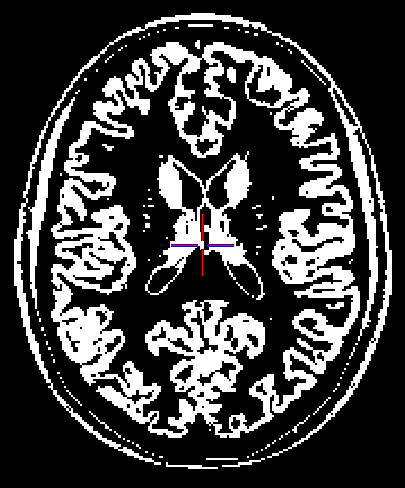
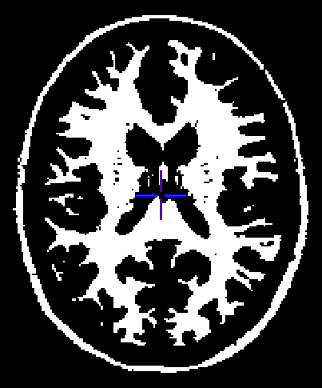

# Contributing to APPIAN
Table of Contents
=================

[1. Introduction](#introduction)

[2. Labels](#labels)

[3. Making a change](#making-a-change)

[4. Adding new PET quantification and PVC methods](#adding-pet-quantification-and-pvc-methods)

[5. APPIAN coding style guide](#appian-coding-style-guide)

[6. Validation](#validation)

[7. Recognizing contributions](#recognizing-contributions)

### Introduction
Here is a guide that will hopefully make it easy to participate. If you have any questions that are not answered in our [User Guide][link_userguide], in the [Developer API guide][link_html] (still in progress, best viewed locally), or below, please do not hesitate to send us an email (tffunck@gmail.com). One day we will have a mailing list or forum, but not yet.
These guidelines are designed to make it as easy as possible to get involved. If you have any questions that are not discussed below, please let us know by opening an [issue][link_issues]!

Before you start you will need to set up a free [GitHub][link_github] account and sign in. Here are some [instructions][link_signupinstructions].

### Labels

The current list of labels are [here][link_labels] and include:

* [][link_helpwanted] *These issues contain a task that a member of the team has determined could benefit from additional help.*

    If you feel that you can contribute to one of these issues, we especially encourage you to do so!

* [][link_bugs] *These issues point to problems in the project.*

    If you find new a bug, please give as much detail as possible in your issue, including steps to recreate the error.
    If you experience the same bug as one already listed, please add any additional information that you have as a comment.

* [][link_enhancement] *These issues are asking for new features to be added to the project.*

    Please try to make sure that your requested feature is distinct from any others that have already been requested or implemented.
    If you find one that is similar but contains subtle differences please reference the other request in your issue.

## Making a change

We appreciate all contributions to APPIAN, but those accepted fastest will follow a workflow similar to the following:

**1. Comment on an existing issue or open a new issue referencing your addition.**

This allows other members of the APPIAN development team to confirm that you are not overlapping with work that is currently underway, and that everyone is on the same page with the goal of the work you are going to carry out.

[This blog][link_pushpullblog] is a nice explanation of why putting this work in up front is so useful to everyone involved.

**2. [Fork][link_fork] the [APPIAN repository][link_appian] to your profile.**

This is now your own unique copy of APPIAN.
Changes here will not effect anyone else's work, so it is a safe space to explore edits to the code!

Make sure to [keep your fork up to date][link_updateupstreamwiki] with the master repository.

**3. Make the changes you have discussed, following the [APPIAN coding style guide][link_style_guide].**

Try to keep the changes focused. If you feel tempted to "branch out" then please make a [new branch][link_branches].
It can also be helpful to test your changes locally, using an [APPIAN development environment][link_devel].

**4. Use [validation script](#validation) to test that the changes don't break anything.**


**5. Submit a [pull request][link_pullrequest].**

A member of the development team will review your changes to confirm that they can be merged into the main codebase.

## Adding PET quantification and PVC methods

APPIAN has been designed to facilitate the additition of new models for PET quantification and PVC algorithms. Here's how to add your method to APPIAN:

### 1 Add model to Tracer_Kinetic / Partial_Volume_Correction
##### Quantification
To add a PET quantification model, in the Tracer_Kinetic/methods directory, create a new python file called quant_method_<your-model-name>.py. 

##### PVC
Similarly, to add a PVC method, add a new python file called pvc_method_<your-model-name>.py in Partial_Volume_Correction/methods.

### 2 Format of "<quant/pvc>_method_<your-model-name>.py"
For examples of how to format the "quant_method_<your-model-name>.py", here is an exmaple of a [voxelwise][link_voxel] model and here is an [ROI-based][link_roi] model. The format for "pvc_method_<your-method-name>.py" is very similar to that for quantification models; you can find an example [here][link_pvc_example].

#### 2.1 Import template
##### Quantification
The "quant_method_<your-model-name>.py" file must import the "Tracer_Kinetic/quantification_template.py" module, which contains the basic template for Nipype nodes for performing PET quantification.

##### PVC
The "pvc_method_<your-model-name>.py" file must import the "Partial_Volume_Correction/methods/pvc_template.py" module, which contains the basic template for Nipype nodes for performing PVC.

#### 2.2 Set variables
##### Quantification
Next, the "quant_method_<your-model-name>.py" file requires 4 variables : in_file_format, out_file_format, reference, and voxelwise. <in_file_format> and <out_file_format> define the the formats of the inputs and outputs to the PET quantification algorithm. For example, if you wish to implement one of the [voxelwise][link_voxel] models from the [Turku PET Centre][link_turku]--which use the ECAT format--then you would set these variables as :

    in_file_format="ECAT"
    out_file_format="ECAT"
    
As another example, if you wish to use an [ROI-based][link_roi] method then the variables would be: 

    in_file_format="ECAT"
    out_file_format="DFT"
    
The "DFT" format is set because the [Turku][link_turku] algorithms will save the results out ROI-based methods as a [".dft"][link_dft] file.
You can also stick to implementing models in using the default MINC files for input and output as follows: 

    in_file_format="MINC"
    out_file_format="MINC"

Next, the <reference> variable is a boolean (True/False) that specifies whether the model uses a reference region (3D volume, defined in the quantification label file) or a reference TAC (defined as a [".dft"][link_dft]). Set to "False" if your model does not require some sort of reference, e.g., SUV.
    
Finally, the <voxelwise> variable specifies whether the model is "voxelwise" or "ROI-based". Set to "True" for voxelwise analysis and "False" for ROI-based analysis.

##### PVC
The "pvc_method_<your-model-name>.py" file requires 2 variable : file_format and separate_labels. <file_format> defines the format of the inputs and outputs to the PVC algorithm. <separate_labels> is a boolean variable (True/False) that determines whether to reformat the 3D volume with regional labels into a 4D volume. In this this case, each 3D sub-volume is a binary volume that codes for one of the regions in the original 3D label volume. For example, in Fig.1.A we have a 3D mask volume with 2 lables: 2=GM, 3=WM. By setting '<seperate_labels=True>', this 3D volume gets split into a 4D volume where the first frame is seen in Fig.1.B and the second frame in Fig.2.C. This option is used for the implementation of [PVCPET][link_pvcpet]. 

A | B | C
--- | --- | ---
||

Fig.1 A: 3D mask volume with 2 labels; B: first frame of 4D mask volume (GM); C: second frame of 4D mask volume (WM).

 
#### 2.3 Setup classes
##### Quantification

The "quant_method_<your-model-name>.py" file requires that you set up 3 classes. 

    class quantInput(MINCCommandInputSpec):

    class quantOutput(TraitedSpec):

    class quantCommand(pvcCommand):

The "quantInput" and "quantOutput" function is where you define the inputs and outputs to your model based on ["traits"][link_traits]. It is very important to note that the input PET file and output parametric file must be called "in_file" and "out_file", respectively. The "quantCommand" inherits from the template in "Tracer_Kinetic/quantification_template.py" and requires that you define two attributes: <\_cmd> and <\_suffix>. The <\_cmd> variable defines the function that will be run in the command line. The <\_suffix> variable is the suffix that will be appended to the input PET file to create the output file name. <\_suffix> should be the same as <your-model-name>.

For more information on input specification and traits, check out the [Nipype documentation][link_nipype].

##### PVC
The "pvc_method_<your-model-name>.py" file requires that you set up 3 classes. 

    class pvcInput(MINCCommandInputSpec):

    class pvcOutput(TraitedSpec):

    class pvcCommand(quantificationCommand):


#### 2.4 Check & assign user options 
##### Quantification
The last thing the "quant_method_<your-model-name>.py" file needs is a function that will be used to assign variables to the PET quantification node based on user inputs:

        def check_options(tkaNode, opts):

The variable <opts> stores user inputs. The function <check_options> checks if certain options have been specified by the user and assigns them to the node. For example:
        
       if opts.tka_LC != None: tkaNode.inputs.LC=opts.tka_LC

If your model requires options that are not yet defined in APPIAN, you can add it to the "Launcher.py" file. The Launcher.py file uses the standard [Python argument parser][link_argparse]. 
    
##### PVC
The same as above applies for "pvc_method_<your-model-name>.py", but with "pvcNode" instead of "tkaNode":
       
       def check_options(pvcNode, opts):
            if opts.scanner_fwhm != None: tkaNode.inputs.fwhm=opts.scanner_fwhm
            
#### (\*) Additional note for 4D PVC
The above assumes that the PVC algorithm will take as input a 4D PET image. However, if the PVC algorithm you are trying to implement in APPIAN only accepts 3D inputs, then the 4D volume has to be split into indivudal time frames. This can be done and has been implemented for [PVCPET][link_pvcpet]; you can find an example [here][link_pvcpet_implementation].


## APPIAN documentation style
Documentation should be provided for all contributions. Documentation is automatically generated using [Sphinx][link_sphinx]
The basic template for documentation should include text in the following format at the start of the module:

    """
    .. module:: <module name>
       :platform: Unix
       :synopsis: <what your module does> 
    .. moduleauthor:: <your name + email>
    """

The template for documenting functions is as follows :

    def my_function(var1, var2)
        '''
        Text describing in detail what your function is supposed to do. In this case, the function adds var1 to var2.

        :param var1: This is the first argument!
        :param var2: This is another argument!
        :type var1: int
        :type var2: int

        :returns: var3 : This is the variable that gets returned by this function!
    '''
    var3 = var1 + var2
    returns var3

Code that is documented in this fashion will automatically be compiled into an elegent [html file][link_html]. If you're adding a new module, then you should add it to the [config.py][link_config] file.


Additionally, please use block comments for every non-trivial operation in your code.


## APPIAN coding style guide

Whenever possible, instances of Nodes and Workflows should use the same names
as the variables they are assigned to.
This makes it easier to relate the content of the working directory to the code
that generated it when debugging.

Workflow variables should end in `_wf` to indicate that they refer to Workflows
and not Nodes.
For instance, a workflow whose basename is `myworkflow` might be defined as
follows:

```Python
from nipype.pipeline import engine as pe

myworkflow_wf = pe.Workflow(name='myworkflow_wf')
```

If a workflow is generated by a function, the name of the function should take
the form `init_<basename>_wf`:

```Python
def init_myworkflow_wf(name='myworkflow_wf):
    workflow = pe.Workflow(name=name)
    ...
    return workflow

myworkflow_wf = init_workflow_wf(name='myworkflow_wf')
```

If multiple instances of the same workflow might be instantiated in the same
namespace, the workflow names and variables should include either a numeric
identifier or a one-word description, such as:

```Python
myworkflow0_wf = init_workflow_wf(name='myworkflow0_wf')
myworkflow1_wf = init_workflow_wf(name='myworkflow1_wf')

# or

myworkflow_lh_wf = init_workflow_wf(name='myworkflow_lh_wf')
myworkflow_rh_wf = init_workflow_wf(name='myworkflow_rh_wf')
```

## Validation
The [validate_appian.sh](https://github.com/APPIAN-PET/APPIAN/blob/master/Test/validate_appian.sh) in Test/ directory runs APPIAN  many times with varying options to check that they all run. In theory, it should be useable with any data set, although in practice it has only been developed using the CIMBI data set availble on OpenNeuro. 

The purpose of this validatation script is to check that changes made to the APPIAN code do not break the package. As such it should be run before pushing any new changes to the Git repository and especially before creating an updated Docker container with a new version APPIAN.

More tests will need to be added in the future as the current set are not exhaustive. Each test can take a long time. It is therefore a good idea to reuse the output of previous tests to avoid rerunning processing stages unecessarily. For example, there is no need to rerun PET-MRI co-registration everytime one wants to test a downstream processing stage, like PVC or quantification. The tests are therefore organized such that at least some of the outputs of the previous tests can be reused for subsequent ones.


## Recognizing contributions

We welcome and recognize all contributions from documentation to testing to code development.
You can see a list of current contributors in our [zenodo file][link_zenodo].
If you are new to the project, remember to add your name and affiliation there!

## Thank you!

You're awesome. :wave::smiley:

<br>

*&mdash; Based on contributing guidelines from the [STEMMRoleModels][link_stemmrolemodels] project.*

[link_github]: https://github.com/
[link_appian]: https://github.com/APPIAN-PET/APPIAN/
[link_userguide]: https://github.com/APPIAN-PET/APPIAN/blob/master/USERGUIDE.md
[link_signupinstructions]: https://help.github.com/articles/signing-up-for-a-new-github-account
[link_react]: https://github.com/blog/2119-add-reactions-to-pull-requests-issues-and-comments
[link_issues]: https://github.com/APPIAN-PET/APPIAN/issues
[link_labels]: https://github.com/APPIAN-PET/APPIAN/labels
[link_discussingissues]: https://help.github.com/articles/discussing-projects-in-issues-and-pull-requests

[link_bugs]: https://github.com/APPIAN-PET/APPIAN/labels/bug
[link_helpwanted]: https://github.com/APPIAN-PET/APPIAN/labels/help%20wanted
[link_enhancement]: https://github.com/APPIAN-PET/APPIAN/labels/enhancement

[link_style_guide]: https://github.com/APPIAN-PET/APPIAN/blob/master/CONTRIBUTING.md#appian-coding-style-guide
[link_pullrequest]: https://help.github.com/articles/creating-a-pull-request/
[link_fork]: https://help.github.com/articles/fork-a-repo/
[link_pushpullblog]: https://www.igvita.com/2011/12/19/dont-push-your-pull-requests/
[link_branches]: https://help.github.com/articles/creating-and-deleting-branches-within-your-repository/
[link_updateupstreamwiki]: https://help.github.com/articles/syncing-a-fork/
[link_stemmrolemodels]: https://github.com/KirstieJane/STEMMRoleModels
[link_zenodo]: https://github.com/APPIAN-PET/APPIAN/blob/master/.zenodo.json
[link_devel]: http://appian.readthedocs.io/en/latest/contributors.html

[link_voxel]: https://github.com/APPIAN-PET/APPIAN/tree/master/Tracer_Kinetic/quant_method_lp.py
[link_roi]: https://github.com/APPIAN-PET/APPIAN/tree/master/Tracer_Kinetic/quant_method_lp-roi.py
[link_dft]: http://www.turkupetcentre.net/petanalysis/format_tpc_dft.html
[link_turku]: http://www.turkupetcentre.net/petanalysis/image_tools.html 
[link_traits]: http://docs.enthought.com/traits/traits_user_manual/intro.html
[link_nipype]: http://nipype.readthedocs.io/en/latest/devel/interface_specs.html
[link_argparse]: https://docs.python.org/3/library/argparse.html
[link_html]:  https://htmlpreview.github.com/APPIAN-PET/APPIAN/blob/master/_build/html/code.html
[link_config]:  github.com/APPIAN-PET/APPIAN/blob/master/conf.py 
[link_pvcpet]:  https://github.com/UCL/PETPVC
[link_pvcpet_implementation]: https://github.com/APPIAN-PET/APPIAN/blob/master/Partial_Volume_Correction/methods/petpvc.py
